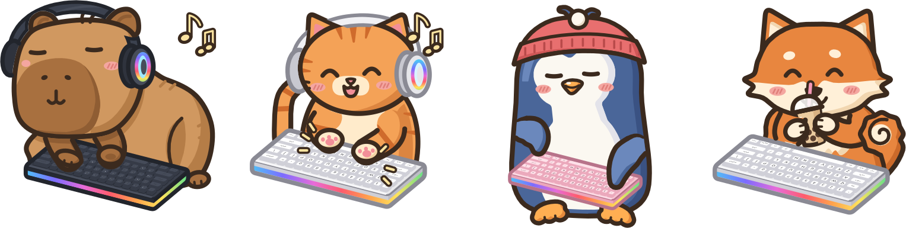
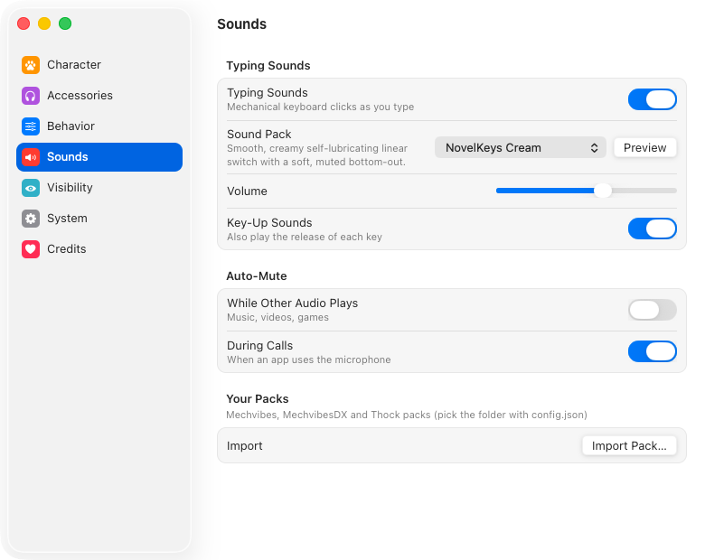

<div align="center">



# typebud

**A tiny desk buddy that types along with you.**

A cozy animal sits in the corner of your screen behind its own little keyboard,<br>
tapping away whenever you type, anywhere on your computer.

macOS · Windows · Linux

[**Download**](https://github.com/plyght/typebud/releases/latest) · [Features](#features) · [Build from source](#build-from-source) · [Privacy](#privacy)

</div>

---

## Features

- **Four friends.** A cat, a capybara, a penguin and a shiba, each hand-drawn with its own personality.
- **Types with you.** Left paw, right paw, both paws on the space bar. Type fast and it gets excited; stop for a while and it falls asleep.
- **Dress it up.** Headphones (with music notes), a beanie, a party hat, a bow or glasses. It can hold a coffee, boba or a book and sip it between sentences. Add a plant, a lamp or a mug, or turn the keyboard off.
- **Three vibes.** Dark, bright and pink keyboards and gear.
- **Clicky sounds (optional).** Nine mechanical keyboard packs, from creamy linears to buckling springs. Import any Mechvibes, MechvibesDX or Thock pack. It mutes itself while other audio plays or you're on a call.
- **Stays out of the way.** Clicks pass straight through everything except the pet. Drag to move it and it snaps to any corner of any display; drag the grip to resize it. Show it only in the apps you pick, or hide it in some.
- **Native everywhere.** Liquid Glass settings on macOS 26+, libadwaita or Breeze on Linux, Mica on Windows. A menu bar or tray icon too.
- **Light as a feather.** When nothing is happening it draws nothing and costs about 0% CPU.

<div align="center">

</div>

## Install

Grab the latest build from [**Releases**](https://github.com/plyght/typebud/releases/latest).

| Platform | Download | Notes |
|---|---|---|
| macOS 12+ (Intel & Apple Silicon) | `Typebud-<version>.dmg` | Drag to Applications. The build isn't notarized yet, so the first time, right-click typebud and choose **Open**. |
| Windows 10/11 | `typebud-setup-<version>-x86_64.exe` | Installs just for you, no admin needed. A portable `.zip` is also there. |
| Linux (x86_64) | `typebud-linux-x86_64.AppImage` | `chmod +x` and run. A `.tar.gz` is also there. |

On **macOS**, typebud notices typing without asking for any permission. Turn on **Precise Typing Detection** in Settings if you'd like the paws to follow exactly which side of the keyboard you hit (macOS will ask for Input Monitoring).

On **Linux under Wayland**, apps can't see system-wide key presses, so typebud reads your keyboard devices directly. Add yourself to the `input` group (`sudo usermod -aG input $USER`, then log out and back in). X11 works out of the box.

## Privacy

typebud only ever learns *that* a key was pressed, and roughly where on the keyboard, so it knows which paw to move. It never sees or stores what you type. It works fully offline. The only time it touches the network is the optional update check, which reads this repo's GitHub releases.

## Build from source

You'll need [Zig 0.17](https://ziglang.org/download/). typebud is built on [zpui](https://github.com/plyght/zpui), a Zig port of Zed's GPU UI framework.

```sh
git clone https://github.com/plyght/typebud && cd typebud
scripts/fetch-zpui.sh          # checks out the pinned zpui into ./zpui
zig build run                  # build and launch
zig build test                 # unit tests
zig build package              # Typebud.app / portable zip / tarball + AppDir
```

On Linux you'll also need the Vulkan, Wayland, X11, FreeType, HarfBuzz and fontconfig development packages. The exact list is in [`.github/workflows/app.yml`](.github/workflows/app.yml).

## Project layout

```
src/        the app: pet window, animation, sounds, settings, tray
art/        the animals, drawn as layered SVGs (see art/SPEC.md and art/STYLE.md)
sounds/     bundled keyboard sound packs and their licenses
updater/    signed over-the-air updates from GitHub Releases
packaging/  icons, the Windows installer and the macOS disk image
scripts/    art previews, sound pack importer, installer and release helpers
```

Working on the art? `python3 scripts/render_art.py <animal>` renders every frame in all three vibes to `art/<animal>/preview/`.

## Releases & updates

Releases are built by GitHub Actions when a `v*` tag is pushed. Automatic updates turn on as soon as an update-signing key is set up; until then each release is a normal download. See [`docs/RELEASING.md`](docs/RELEASING.md) and [`docs/UPDATES.md`](docs/UPDATES.md).

## Credits

Sound packs come from [kbsim](https://github.com/tplai/kbsim) and [Keyboard Sounds Pro](https://github.com/keyboard-sounds/keyboardsounds-pro) (MIT), with full attributions in [`sounds/LICENSES.md`](sounds/LICENSES.md) and in the app under **Settings → Credits**. Keycap legends use [Nunito](https://github.com/googlefonts/nunito) (SIL OFL 1.1). Inspired by the lovely [Typibara](https://www.typibara.com/).

<div align="center">
<sub>made with paws by <a href="https://github.com/plyght">plyght</a></sub>
</div>
